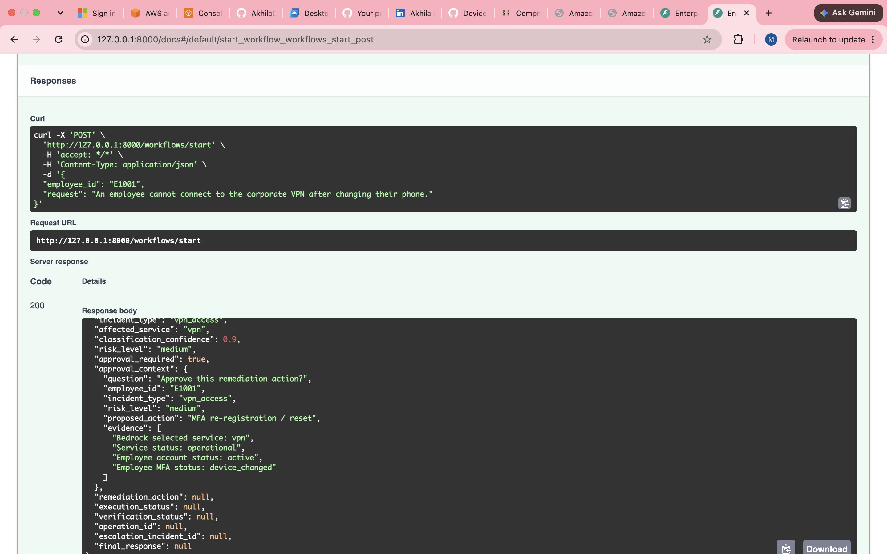
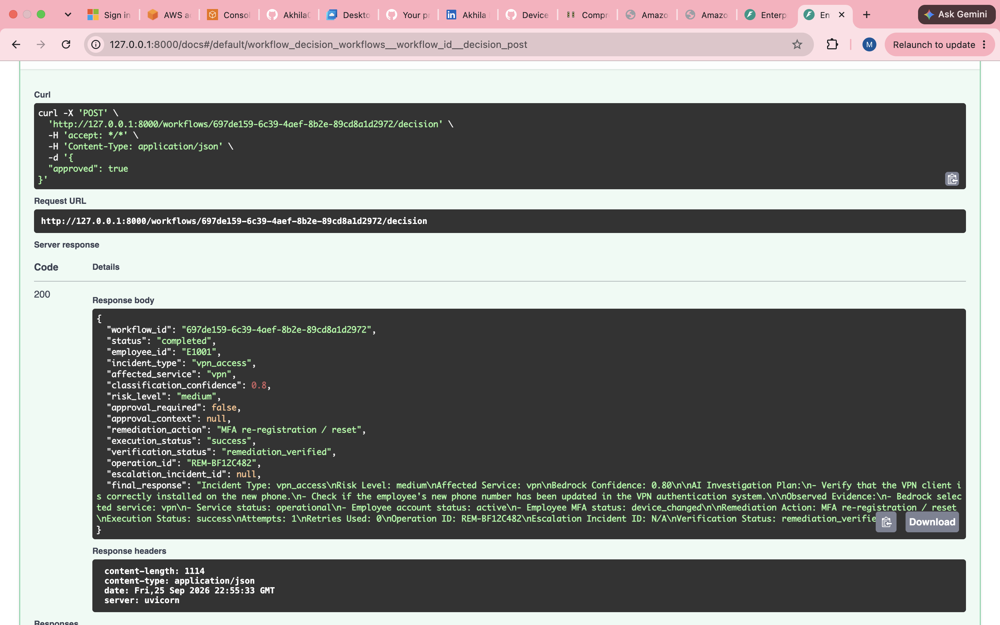
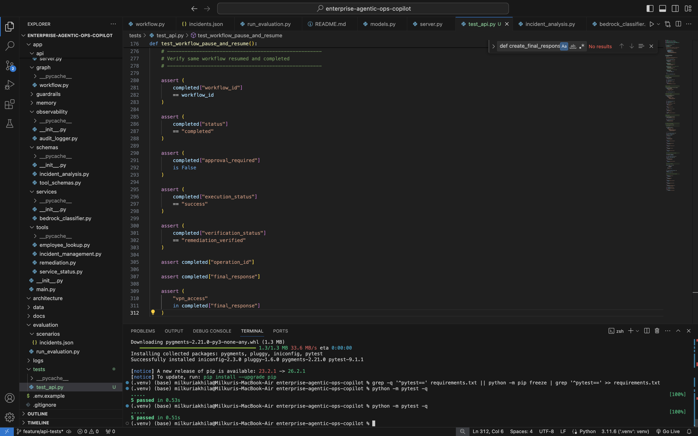

# Enterprise Agentic Ops Copilot

Enterprise-style **Agentic AI operations copilot** built with Amazon Bedrock, Amazon Nova Pro, LangGraph, Python, and structured enterprise tools.

The system analyzes IT support incidents, reasons about the affected service, gathers evidence using tools, assesses operational risk, requests human approval when required, performs remediation, retries transient failures, escalates unresolved incidents, and records an audit trail.

---

## Project Highlights

- Amazon Bedrock + Amazon Nova Pro
- LangGraph stateful agent orchestration
- Structured Pydantic outputs
- Enterprise tool calling
- Human-in-the-loop approval with interrupt/resume
- Retry and escalation handling
- FastAPI REST API
- Swagger/OpenAPI documentation
- Structured audit logging
- Automated pytest coverage
- Live multi-scenario Bedrock evaluation
## Demo

### Human-in-the-Loop Approval

The agent analyzes the incident, gathers evidence, assesses operational risk, and pauses before sensitive remediation until explicit human approval is provided.



### Stateful Workflow Resume

After approval, LangGraph resumes the same workflow thread and continues remediation, verification, and final response generation.



### Automated Testing

The project includes deterministic API and workflow tests that validate the approval lifecycle without making live Amazon Bedrock calls during unit testing.



The current automated test suite completes successfully with **5 passing tests**.
---

## Architecture

```text
User Request
     |
     v
Amazon Nova Pro
via Amazon Bedrock
     |
     v
Structured Incident Analysis
     |
     +--> Incident Type
     +--> Affected Service
     +--> Confidence Score
     +--> Investigation Plan
     |
     v
LangGraph Agent Workflow
     |
     v
Enterprise Tool Execution
     |
     +--> Service Status Tool
     +--> Employee Lookup Tool
     |
     v
Observed Evidence
     |
     v
Risk Assessment
     |
     +---------------------------+
     |                           |
     v                           v
Low Risk                    Medium / High Risk
     |                           |
     v                           v
Auto Execution              Human Approval
     |                           |
     +-------------+-------------+
                   |
                   v
           Remediation Tool
                   |
                   v
           Retry / Escalation
                   |
                   v
              Verification
                   |
                   v
             Final Response
                   |
                   v
              Audit Log
